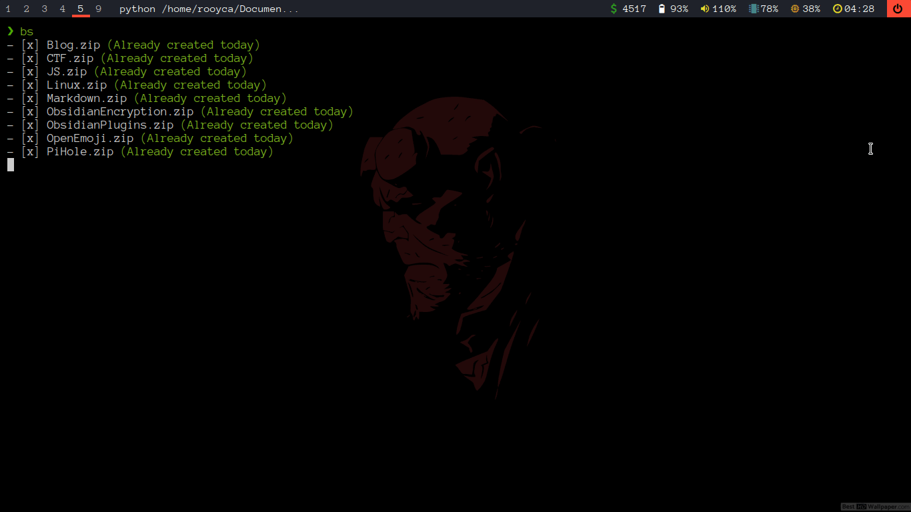

# rooykup - Backup and sync tool




## Table of Contents

- [Configuration](#configuration)
- [Usage](#usage)
- [Contributing](#contributing)
- [License](#license)

## Configuration

### rclone

- Download rclone from https://rclone.org/downloads/
- Configure rclone with `rclone config`. Follow the instructions from https://rclone.org/docs/
- Set a strong configuration password and save it in a `confg` file in `~/.config/rooykup`

### rooykup

- Clone this repository
- Create a `config.toml` file in `~/.config/rooykup` with the following structure:

```toml
[config]
workingDirectory = "/path/to/working/directory"
shutDownAfterBackup = false
alwaysCompress = false
remote = ["remote:folder", "remote2:"]
local = "local:"
configPass = "here your super secure passphrase for rclone config" 

[exclude]
directories = [".git", "node_modules"] # If none leave it empty 

[[pathAndDirName]]
path = "/path/to/folder/to/backup"
zipName = "NameOfTheZipFile

[[pathAndDirName]]
path = "/path/to/folder/to/backup2"
zipName = "AnotherNameOfTheZipFile"
```

You can add as many `[[pathAndDirName]]` as you want.

## Usage

- Run `python rooykup.py` to start the backup process
- If you want to run it periodically, you can use `cron` or `systemd`

You can also create an alias in your `.bashrc` file or `.zshrc` file

```bash
alias rooykup="python /path/to/rooykup.py"
```

If you want to shut down your computer after the backup process, set `shutDownAfterBackup` to `true` in your `config.toml` file or run it with the `-s` flag.

If you want to always compress the files, set `alwaysCompress` to `true` in your `config.toml` file or run it with the `-c` flag. This will compress even if the directory already has a compressed file from today.

### Polybar module

If you want to use the polybar module, add the following to your polybar config file:

```ini
[module/bs]
type = custom/script
exec = echo " "
format-prefix = "  "
format-prefix-foreground = #000
format-background = #fb4934
click-left = alacritty --hold -e python /path/to/rooykup.py -s
```

Here I'm using `alacritty` as my terminal emulator, but you can change it to whatever you want.

## Contributing

Any contributions you make are **greatly appreciated**. <3

## License

Distributed under the MIT License. See `LICENSE` for more information.
